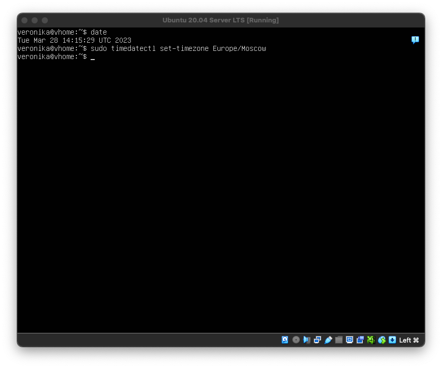
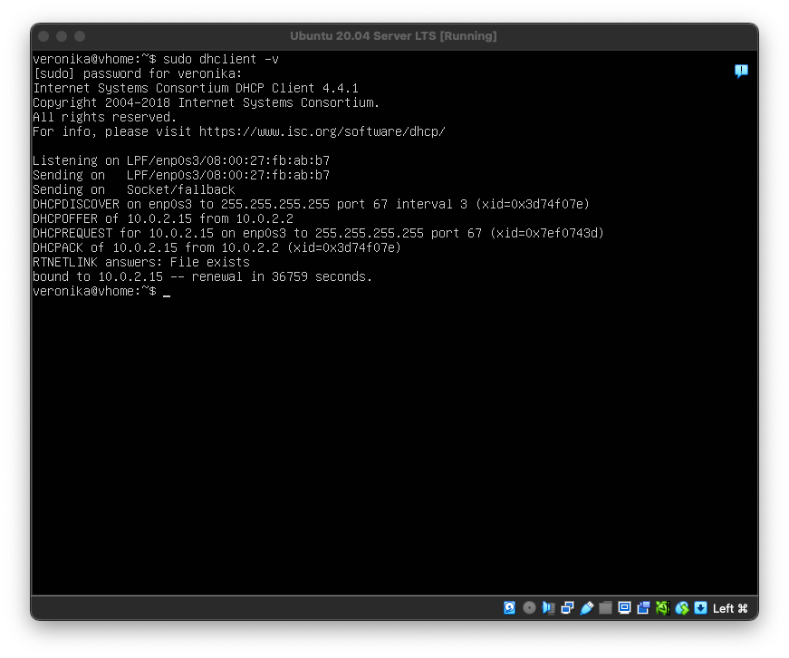
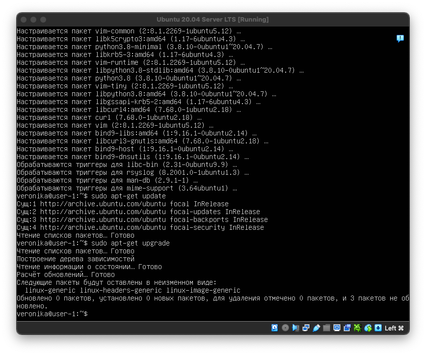
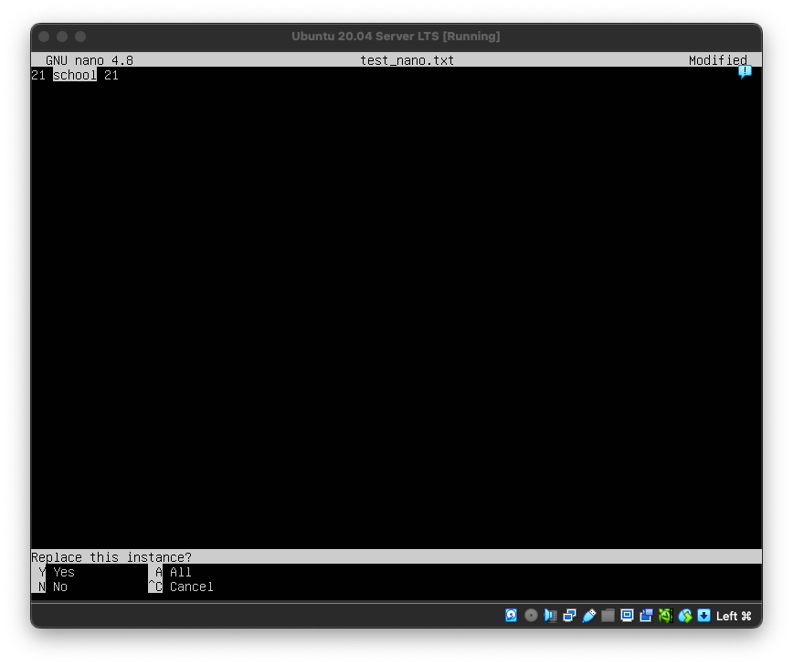
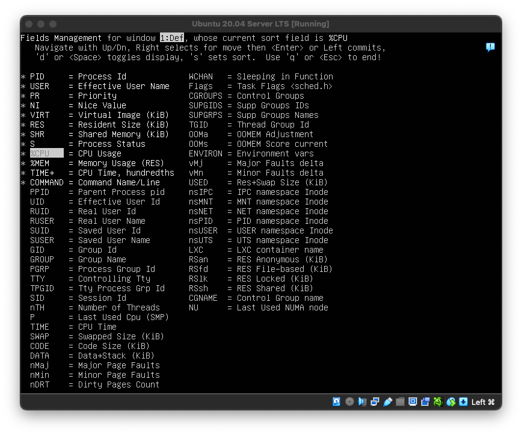

# Linux

## Part 1. Установка ОС

Linux установлен, вывод информации о версии ОС командой: `cat /etc/issue`

## Part 2. Создание пользователя

1. создадим нового пользователя и сразу поместим его в группу adm при помощи команды: `sudo useradd -g adm RocketUser`

2. проверка с помощью вывода команды: `cat /etc/passwd`

## Part 3. Настройка сети ОС

1. Зададим название машины вида user-1 : `sudo hostnamectl set-hostname user-1`

2. Установить временную зону : `sudo timedatectl set-timezone Europe/Moscow`

3. Вывести названия сетевых интерфейсов командой: `ip link show`
    - Интерфейс **lo (loopback device)** - это виртуальный сетевой интерфейс (интерфейс петли обратной связи), который не имеет связи с каким-либо оборудованием оборудованием, а реализован исключительно програмно. Любой сигнал, отправленный на интерфейс lo, получается тем же интерфейсом. 
    - **lo** может использоваться для отладки сетевых программ и запуска серверных приложений на локальной машине.

4. Получить ip адрес устройства, на котором вы работаете, от DHCP сервера используя консольную команду: `sudo dhclient -v`
    - DHCP - это протокол клиента или сервера, который автоматически предоставляет узел протокола IP с его IP-адресом и другие связанные сведения о конфигурации, такие как маска подсети и шлюз по умолчанию.

5. Определение и вывод на экран внешний ip-адрес шлюза (ip) и внутренний IP-адрес шлюза, он же ip-адрес по умолчанию (gw)
    - выведем внутренний ip шлюза (ip) командой `ip route | grep default`

    - выведем внешний ip шлюза (ip) командой `ping localhost`

6. статичные настройки ip, gw, dns :
    - для изменения конфигурации файла потребуется команда `sudo vi /etc/netplan/00-installer-config.yaml`. После выполнения данной команды добавим:
    
    - для проверки правильности заполнения файла конфигурации выполним следующие команды: `sudo netplan apply` и `sudo netplan try`
    

7. Перезагрузка виртуальной машины и проверка соответствия статичных сетевых настроек (ip, gw, dns) заданным в предыдущем пункте  :
    - для перезагрузки используем команду `sudo reboot`
    - проверка соответствия gw  и ip машины, заданных статически, командой `ip route`
    
    - для проверки dns будем использовать команду `sudo systemd-resolve --status`
    
    

8. удаленные хосты пропингованы `ping 1.1.1.1` , `ping ya.ru`
    - в выводе команды присутствует фраза "0% packet loss"

## Part 4. Обновление ОС

- Обновим системные пакеты до последней на момент выполнения задания версии с помощью команды `sudo apt-get update`
- с помощью команды `sudo apt-get upgrade` обновим все устаревшие пакеты до последней версии 
- сообщение об отсутствующих обновлениях

## Part 5. Использование команды **sudo**
- чтобы разрешить пользоваться данной командой пользователю, созданному во второй части задания, нужно выполнить следующую команду `sudo usermod –aG sudo RocketUser`
    Rоманда sudo, позволяет запускать программы от имени других пользователей, а также от имени суперпользователя root. Имя команды означает substitute user do или super user do. 
    Root или суперпользователь (корневой пользователь) — это специальный аккаунт и группа пользователей в UNIX-подобных системах с идентификатором пользователя UID 0, владелец которого имеет право на выполнение всех без исключения операций.
 
- Для смены пользователя используем команду `su - RocketUser`
- Смена названия машины выполняется командой `sudo hostnamectl set-hostname user-2`
- Перезагрузка `sudo reboot`
- Отображение пользователя и имя машины

## Part 6. Установка и настройка службы времени

- Установка пакета синхронизации времени ntp командой `sudo apt-get install systemd-timesyncd -y`
- Активация ntp командой `timedatectl set-ntp true`
- Вывод команды «timedatectl show» содержит `NTPSynchronized=yes`

## Part 7. Установка и использование текстовых редакторов 

  1. Установка текстовых редакторов vim, nano, mcedit
     установка текстового редактора с помощью команды `sudo apt install <editor_name>`
  

  2. Создание файлов в каждом из текстовых редакторов:
  - **vim** сохранение и выход из vim с помощью:
      **i > veronika > esc > :wq!**
  
  - **nano** сохранение и выход из nano с помощью:
      **veronika > Ctrl+ O > enter >  Ctrl+ X**
  
  - **mcedit** сохранение и выход из mcedit с помощью:
     **veronika > F2 > Yes > F10**
  

  3. Замена ника в файле на «21 school 21» без последующего сохранения
  - **vim** : del veronika > i > 21 school 21 > esc > :q! 
  
  - **nano** : del veronika > 21 school 21 > Ctrl + X > N
  
  - **mcedit** : del veronika > 21 school 21 > F10 > “Нет”
  

  4. Редактирование файла, Поиск и Замена слова в файле
  - **vim** : i > del veronika > 21 school 21 > esc > :s/school/basketball > :q! 
  
  
  - **nano** : del veronika > 21 school 21 > Ctrl+\ > Ctrl + X > N
  
  
  - **mcedit** :
    - del veronika > 21 school 21
    - F7 > school > enter;
    - F4 > school > SBER > "дальше" > "заменить"
    - F10 > “Нет”
  
  
  
  

## Part 8. Установка и базовая настройка сервиса **SSHD**

  1. Установка SSHd командой `sudo apt install ssh`
  

  2. Добавление автостарта при загрузки сестемы командой `sudo systemctl enable ssh`
  

  3. Перенастройка службы SSHd на порт 2022
  - Смена порта в файле конфигурации с помощью команды: `sudo nano /etc/ssh/sshd_config`
  
  - Перезапуск ssh командой: `systemctl restart ssh`
  - Проверка изменения порта `service ssh status`
  

  4. Проверка наличия процессора sshd
  - просмотр запущенных ssh с помощью команды `ps ax | grep ssh`
  
  **ps** (process status) - это встроенная программа для Unix-подобных операционных систем. Прежде всего, она широко используется при администрировании ОС семейства GNU / Linux. С ее помощью осуществляется мониторинг активных процессов по виртуальным файлам в файловой системе /proc.
  **ax** – ключ, позволяющий увидеть каждый процесс в системе, используя синтаксис BSD

  5. Перезагрузка системы
  - перезагрузка `sudo reboot`
  - Проверка вывода команды `netstat -tan`
  
  - Объяснение значения ключей –tan, значения каждого столбца вывода, значения 0.0.0.0:
    * -t - Отображение только TCP/IP текущего подключения в состоянии переноса нагрузки с процессора на сетевой адаптер при передаче данных.
    * -a - Отображение состояний всех сокетов.
    * -n - Отображение адресов и номеров портов в числовом формате.
    * Proto - протокол (tcp, udp, raw), используемый сокетом. TCP/IP — сетевая модель передачи данных, представленных в цифровом виде. Модель описывает способ передачи данных от источника информации к получателю.
    * Recv-Q - количество байт данных, помещенных в буфер для чтения программой из данного сокета.
    * Send-Q - количество байт данных, помещенных в буфер отправки по протоколу TCP/IP, которые не отправлены или отправлены, но получение котрых не подтверждено (ACK).
    * Local Address - адрес и номер порта локального конца сокета.
    * Foreign Address - адрес и номер порта удалённого конца сокета.
    * State - Состояние сокета. LISTEN - Сокет ожидает входящих подключений. ESTABLISHED - Сокет находится в состянии установленного подключения.
    * Адрес 0.0.0.0 означает «любой IP данного компьютера» и включает в себя в том числе 127.0.0.1. Адрес 0.0.0.0 обычно означает, что IP адрес ещё не настроен или не присвоен. Такой адрес указывает хост, который обращается к DHCP для получения IP адреса.

## Part 9. Установка и использование утилит **top**, **htop**

1. Установка **top** и запуск

- время безостановочной работы – 11 минут
- количество автоматизированных пользователей – 1
- общая загрузка систем – 0.00, 0.01, 0.02
- общее количество процессоров – 91
- загрузка cpu – 0.0%  от общего времени 
- загрузка памяти:
  - всего памяти: 1983.4;
  - использовано: 146.1;
  - кэшировано: 326.9;
- для сортировки процессов по тем или иным показателям: Shift + F > необходимый показатель  > Enter > перемещаем > Esc

- pid процесса занимающего больше всего памяти – PID: 619 (%M 0, 1)

- pid процесса, занимающего больше всего процессорного времени – PID: 619 (0:01:10)

 2. **htop**

- сортировка процессов по (используя F6):
- PID
  
- PERCENT_CPU
  
- PERCENT_MEM
  
- TIME
  
- фильтрация для процесса sshd (F4):
  
- поиск процесса syslog (F3)
  
- добавление в вывод hostname, clock и uptime (F2)
  

## Part 10. Использование утилиты **fdisk**

 Используем команду `sudo fdisk -l` и изучаем выдачу 

  
  - sda2 – название жесткого диска
  - 3G – размер жесткого диска 
  - 6285312 – количество секторов 
  - swap – не используется

## Part 11. Использование утилиты **df** 

 Запуск команды `df /` для корневого раздела 

- Отчёт для корневого раздела:
  - размер раздела 3018536
  - размер занятого пространства - 2845024
  - размер свободного пространства - 0
  - процент использования - 100%
- Единица измерения в выводе - 1K-blocks

 Запуск команды `df -Th /` для корневого раздела 

- Отчёт для корневого раздела:
    - размер раздела - 2,9G
    - размер занятого пространства - 2,8G
    - размер свободного пространства - 0
    - процент использования - 100%
- Тип файловой системы раздела - ext4

## Part 12. Использование утилиты du
1. Вывод размера папок /home, /var, /var/log в байтах
  * Вывод с помощью команды `sudo du –bs /home /var` и `sudo du –bs /var/log`, где: b- представление в байтах, s- суммарный размер

2. Вывод размера папок /home, /var, /var/log в единицах измерения удобных для человека с помощью опции -h
  * Для этого выведем результаты команды `sudo du –hs /home /var` и `sudo du –hs /var/log`

3. Вывод размера каждого вложенного элемента в /var/log в единицах измерения удобных для человека
  * Для вывода используем команду `sudo du –h /var/log/*`

## Part 13. Установка и использование утилиты **ncdu**
* Вывод утилиты **ncdu**
 - для установки утилиты используем команду `sudo apt install ncdu`
 - для запуска используем команду `sudo ncdu /`
 - для навигации используем стрелки,  enter для выбора

## Part 14. Работа с системными журналами
 * Открыть журнал vi /var/log/dmesg

 * Открыть журнал sudo vi /var/log/syslog

 * Открыть журнал sudo vi /var/log/auth.log

  - время последней успешной авторизации – Mar 29 12:13
  - имя пользователя – veronika
  - Метод входа в систему – login

 * Cкрин с сообщением о рестарте службы SSH

## Part 15. Использование планировщика заданий **CRON**

1. Добавление команды «uptime» в планировщик задания 
  - используем команду `crontab -e` для добавления задания в планировщик 
  - ввод в конец файла `*/2 * * * * uptime`, что означает вызов команды каждые 2 минуты 

  - проверка запуска команды с заданным интервалом команды `sudo grep –i cron /var/log/syslog `

2. Удаление задач из планировщика задний 
  - удаляем задачи из планировщика командой `crontab -r`
  - проверяем, что запланированных задач нет, командой `crontab -l`

